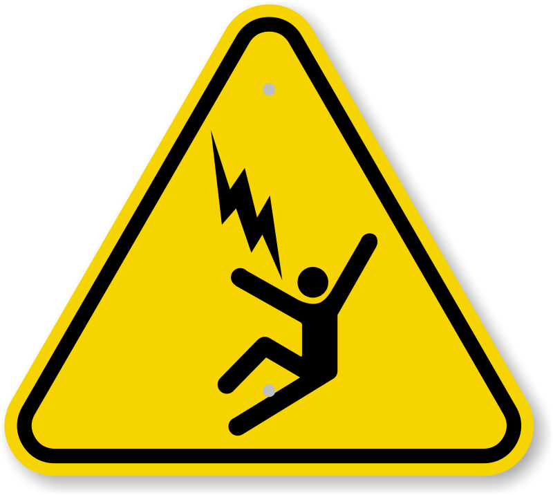

  
# circuit-breaker-js

The goal is simple. You are the circuit. If you notice someone getting 
eletrocuted. You should probably stop!

## Description

Circuit Breakers are a common pattern we see in high volume, high throughput 
services at [ATG](https://www.accretivetg.com/).

Some of our high throughput services will deliver thousands if not millions of
requests in short windows. Sometimes resources underneath are rotating and experience failure,
they are deploying and are more resource constrainted, or we are receieving a massive influx of
traffic for many other reasons.

This library provides a no dependencies implementation of a lightweight circuit breaker
designed to resolve issues when you hit them.

## How to Use

```bash
$ npm install 
```

Then you can build the circuit breaker into module state for your component and operate
it on this way in a koa-esque paradigm.

```javascript
import CircutBreaker from 'circuit-breaker';
const breaks = new CircuitBreaker({name: "my-brakes");

async function handleRequest(ctx => {
   if (brakes.active()) {
     ctx.status = 429;
     return;
   }
  
   const start = Date.now();
   /**
    * Do work
    */
   
   if (success) {
     brakes.addSuccess({timing: Date.now() - start});
   } else {
     brakes.addError({timing: Date.now() - start});
   }
   
   // continue on
});
```

Experimentally you can try passing a promise that will be managed via exceptions

```javascript
const CircuitBreaker from 'circuit-breaker';
const breaks = new CircuitBreaker({name: "my-brakes"}).run;

async function handleRequest(ctx => { 
  brakes(() => {
      /**
       * Do work. Exceptions recorded as errors
       */
  }).catch(e => {
    ctx.status = e?.statusCode ?? 500;
  });
});

```
